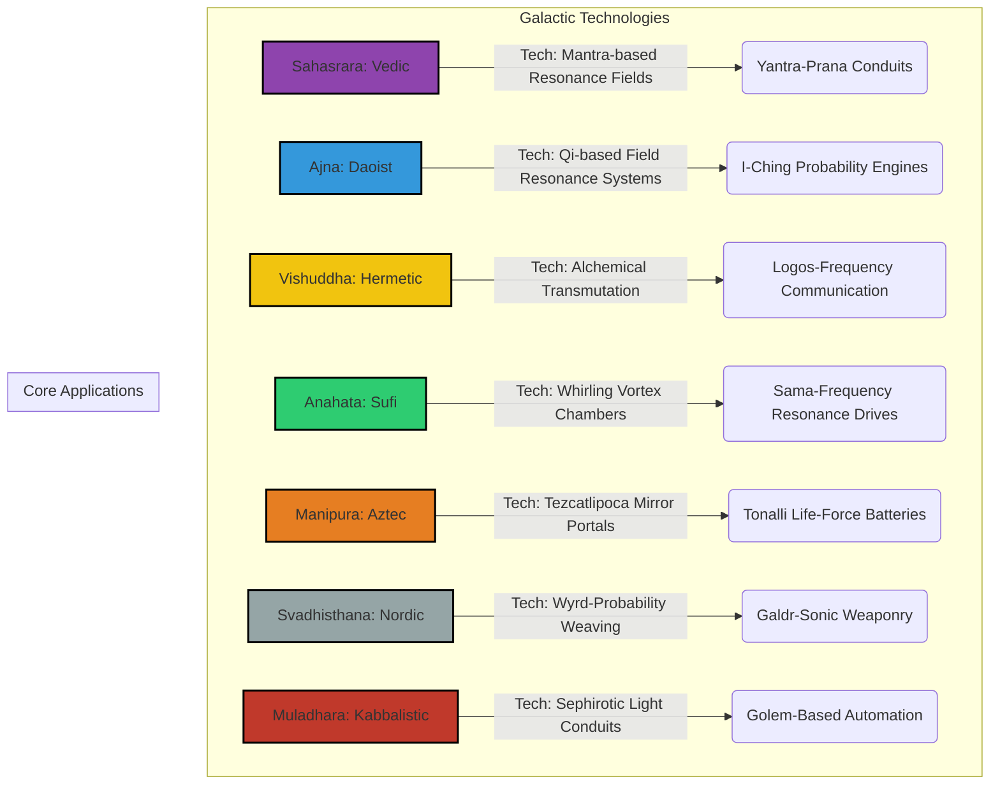

# Galactic Technology Map

This diagram illustrates the unique technological expressions of each galactic culture, rooted in their core philosophies.

```mermaid
graph TD
    subgraph Galactic Technologies
        A[Sahasrara: Vedic] -->|Tech: Mantra-based Resonance Fields| B(Yantra-Prana Conduits)
        C[Ajna: Daoist] -->|Tech: Qi-based Field Resonance Systems| D(I-Ching Probability Engines)
        E[Vishuddha: Hermetic] -->|Tech: Alchemical Transmutation| F(Logos-Frequency Communication)
        G[Anahata: Sufi] -->|Tech: Whirling Vortex Chambers| H(Sama-Frequency Resonance Drives)
        I[Manipura: Aztec] -->|Tech: Tezcatlipoca Mirror Portals| J(Tonalli Life-Force Batteries)
        K[Svadhisthana: Nordic] -->|Tech: Wyrd-Probability Weaving| L(Galdr-Sonic Weaponry)
        M[Muladhara: Kabbalistic] -->|Tech: Sephirotic Light Conduits| N(Golem-Based Automation)
    end

    subgraph Core Applications
        B
        D
        F
        H
        J
        L
        N
    end

    style A fill:#8E44AD,stroke:#000,stroke-width:2px
    style C fill:#3498DB,stroke:#000,stroke-width:2px
    style E fill:#F1C40F,stroke:#000,stroke-width:2px
    style G fill:#2ECC71,stroke:#000,stroke-width:2px
    style I fill:#E67E22,stroke:#000,stroke-width:2px
    style K fill:#95A5A6,stroke:#000,stroke-width:2px
    style M fill:#C0392B,stroke:#000,stroke-width:2px
```