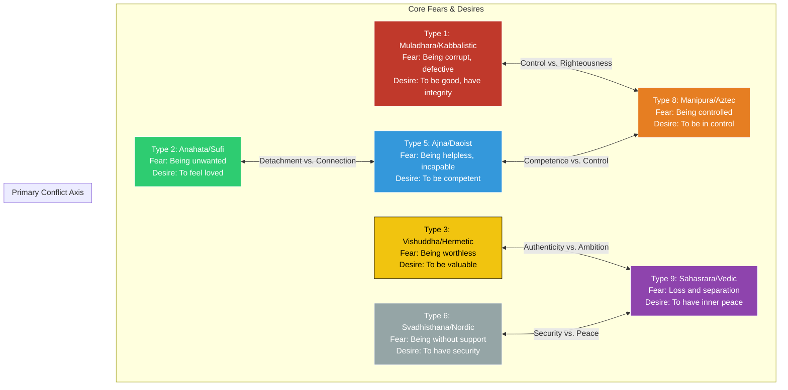

# Inter-Galactic Tensions: An Enneagram Perspective

This diagram maps the primary psychological tensions between the seven galactic cultures, using the Enneagram as a framework for understanding their core fears and desires.

