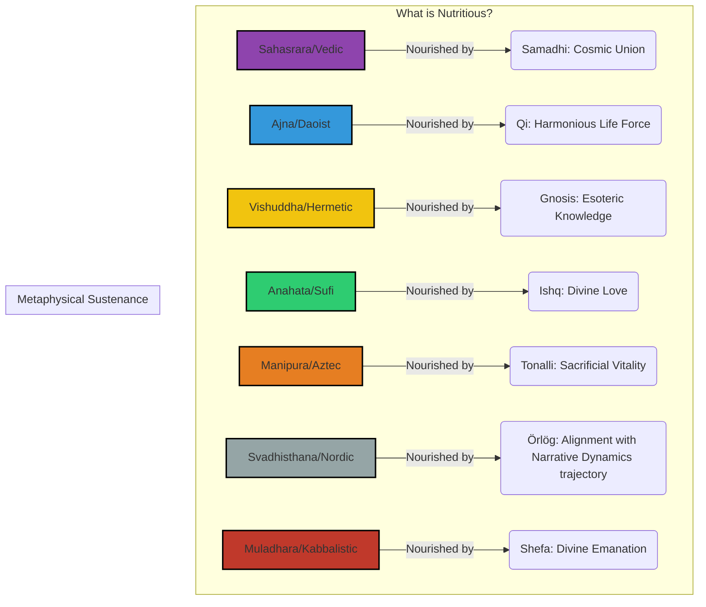

# Galactic Nutrition: What Sustains Life

This diagram illustrates how each galactic culture defines "nutrition" based on its core Khalorēē, showing that sustenance is derived from philosophical and metaphysical sources, not just physical matter.

