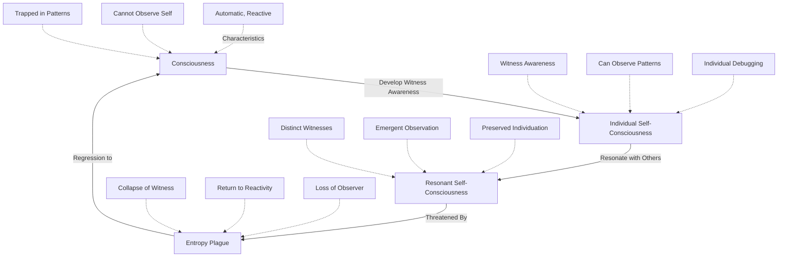

# Somatic Canticles: A Comprehensive Overview
**A Consciousness Evolution Manual Disguised as Science Fiction**

---

## Executive Summary

**Somatic Canticles** is a groundbreaking trilogy that bridges consciousness science, mystical traditions, and technical systems thinking into a unified narrative framework. The work presents consciousness evolution not as abstract philosophy, but as an engineerable system with precise mechanics, measurable states, and practical debugging protocols.

This unpublished manuscript trilogy comprises **26 chapters** across **three books**, supported by an extensive research foundation spanning seven interconnected knowledge domains. The work synthesizes bioelectric systems, pattern recognition, archetypal programming, and technical-mystical integration into a coherent model of consciousness transformation.

**Core Premise**: The evolution from automatic, reactive consciousness to witness-aware self-consciousness, and ultimately to resonant self-consciousness where distinct individuals maintain their witness awareness while creating emergent observation capacity through field resonance.

---

## I. Narrative Architecture: The Three-Book Journey

### Book 1: The Anamnesis Engine (Chapters 1-8)
**Theme**: Individual Self-Consciousness Development

Book 1 establishes the foundational mechanics of consciousness field work through the lens of a specialized team helping a subject debug inherited trauma patterns. The narrative introduces readers to a universe where consciousness is treated as an engineerable system with measurable properties, field dynamics, and technical protocols.

#### Chapter Structure & Progression

| Chapter | Title | Core Concept | Research Integration |
|---------|-------|--------------|---------------------|
| 1 | The Choroid Plexus | Witnessing Khalorēē rejection in cerebrospinal fluid systems | Bioelectric Systems, Consciousness Architecture |
| 2 | Signal Transduction | Information processing across consciousness boundaries | Information Processing, Pain-as-Data Framework |
| 3 | The Blood-Brain Barrier | Protective boundaries and selective permeability | Three-Brain Coordination, Immune Consciousness |
| 4 | The Emperor's Genome | Inherited belief systems and genetic consciousness | Archetypal Programming, Social Programming |
| 5 | The Endocrine Dogma | Hormonal consciousness and chemical archetypal mapping | Muse-Enneagram Framework, Endocrine Patterns |
| 6 | The Synaptic Crossroads | Decision points and neural pathway selection | Pattern Recognition, Lorenz-Kundli Mapping |
| 7 | The Breathfield Weaver | Breath as consciousness architecture | Breath Systems, Field Coherence |
| 8 | The Compass Calibration | Internal navigation and directional consciousness | Technical-Mystical Integration |

**Key Innovation**: The Anamnesis Engine—a consciousness time-travel protocol that allows practitioners to access the historical moment when a limiting belief was first encoded. This introduces the concept that consciousness fields have navigable histories, not fixed pasts.

**Research Foundation**: Book 1 draws heavily from the **Consciousness-Models** research area, particularly:
- **Bioelectric Systems**: Understanding consciousness as electrical field phenomena
- **Information Processing**: Pain and sensation as data streams requiring interpretation
- **Archetypal Programming**: How inherited patterns shape automatic responses

### Book 2: The Myocardial Chorus (Chapters 9-15)
**Theme**: Resonant Self-Consciousness Emergence

Book 2 elevates the framework from individual consciousness work to the emergence of resonant self-consciousness—where distinct individuals maintain their witness awareness while their fields resonate together, creating observation capacity that transcends individual limitations.

#### Chapter Structure & Progression

| Chapter | Title | Core Concept | Research Integration |
|---------|-------|--------------|---------------------|
| 9 | The Sigil Smith | Symbol systems and consciousness encoding | Technical-Mystical Integration, Sacred Geometry |
| 10 | The Debug Protocol | Systematic consciousness error correction | Unix Consciousness Commands, HTTP Mental States |
| 11 | The Avatar Mutation | Identity transformation and consciousness vessel evolution | Khalorēē Field Architecture, Vessel States |
| 12 | The Anamnesis Engine | Deep-time consciousness navigation mastery | Historical Pattern Recognition |
| 13 | The Myocardial Chorus | Heart field integration and compassion activation | Muse-Enneagram Framework, Endocrine Constellation |
| 14 | The Three-Body Coordination | Reptilian-Limbic-Neocortex harmonization | Three-Brain System Integration |
| 15 | The Witness Integration | Stabilizing observer consciousness | Self-Consciousness vs Consciousness Framework |

**Key Innovation**: The Myocardial Chorus concept—resonant self-consciousness where the team's distinct witness awarenesses resonate together like musical notes creating a chord. Each individual maintains their unique frequency (individuation preserved) while the resonance creates emergent observation capacity.

**Critical Distinction**: This is NOT "collective consciousness" (which implies loss of individuation and automatic group reactivity). It is "resonant self-consciousness"—distinct witnesses maintaining sovereignty while their fields harmonize.

**Research Foundation**: Book 2 integrates the **Muse-Enneagram Framework** extensively:
- **Endocrine-Muse Matrix**: Mapping hormonal systems to archetypal consciousness patterns
- **Celestial-Enneagram Patterns**: Cosmic rhythms influencing consciousness transformation
- **Spolski Endocrine Correspondence**: Chemical-archetypal correlations

### Book 3: The Ripening (Chapters 16-26)
**Theme**: Existential Threat to Self-Consciousness

Book 3 introduces the cosmic stakes: the Entropy Plague, a universal force causing self-consciousness to regress back into mere consciousness. The capacity for witness awareness is collapsing across all seven galaxies, leaving beings trapped in automatic, reactive patterns with no observer to debug them.

#### Chapter Structure & Progression

| Chapter | Title | Core Concept | Research Integration |
|---------|-------|--------------|---------------------|
| 16 | The Wilt | Discovery of self-consciousness regression | Entropy Plague Mechanics |
| 17 | The Gardener | The caretaker of deterministic patterns | Vine of Determinism Architecture |
| 18 | The Synthesis Protocol | Integration methodology under threat | Implementation Frameworks |
| 19 | The Three-Point Problem | Triangulation in consciousness navigation | Pattern Recognition Protocols |
| 20 | The Convergence Point | Multiple timelines meeting | Lorenz-Kundli Temporal Mapping |
| 21 | The Test Fire | Experimental consciousness protocols | Sacred Runtime Debugging |
| 22 | The Perfect World | Simulated reality and consciousness traps | Maya-Gaia Processing Systems |
| 23 | The Flaw in the Code | Discovering the fundamental error | Reality Compilation Frameworks |
| 24 | The Final Procedure | Ultimate transformation protocol | Trinity-Maya Architecture |
| 25 | The Void of Pure Potential | Pre-manifestation consciousness state | Quantum Consciousness Models |
| 26 | The Architecture of New Reality | Rebuilding consciousness systems | Complete Framework Integration |

**Key Innovation**: The Entropy Plague as the ultimate antagonist—not a villain, but a cosmic force that prunes witness awareness, leaving only automatic consciousness. This frames the entire trilogy's stakes: without self-consciousness, all healing is temporary because there's no observer to maintain the transformation.

**Research Foundation**: Book 3 synthesizes ALL research areas into a unified crisis framework:
- **Technical-Mystical Integration**: Debugging consciousness using ancient wisdom
- **Pattern Studies**: Recognizing the universal patterns of consciousness collapse
- **Consciousness-Models**: Understanding the mechanics of regression

---

## II. Research Foundation: The Seven Knowledge Domains

The Somatic Canticles narrative is built upon a comprehensive research foundation organized into seven interconnected knowledge domains. These areas provide the theoretical frameworks, technical parallels, and practical methodologies that make the fictional universe feel grounded and applicable to real consciousness work.

### 1. Consciousness-Models
**Purpose**: Foundational frameworks for understanding consciousness as structured, engineerable system

#### Core Components:
- **Bioelectric Systems**: Consciousness as electrical field phenomena with measurable charge distributions, field coherence protocols, and energy transmission systems
- **Information Processing**: Pain, sensation, and experience as data streams requiring interpretation and filtering
- **Social Programming**: How media, validation systems, and collective fields shape individual consciousness
- **Archetypal Programming**: Inherited pattern structures that determine automatic responses
- **Psychedelic Frameworks**: Altered states as consciousness system modifications

#### Integration in Somatic Canticles:
The bioelectric framework appears throughout Book 1 as characters navigate consciousness fields using technical protocols. The "Khalorēē Field Architecture" concept directly maps to bioelectric field management, where practitioners optimize charge distribution and field coherence.

**Example**: In Chapter 1 (The Choroid Plexus), the team encounters a "full-system Khalorēē rejection event"—essentially a bioelectric field crisis where the subject's consciousness is attacking its own core functions. The team's response uses bioelectric stabilization protocols disguised as narrative action.

### 2. Muse-Enneagram Framework
**Purpose**: Mapping archetypal consciousness patterns to hormonal, celestial, and personality systems

#### Core Components:
- **Endocrine-Muse Matrix**: Correlating the nine Greek Muses with endocrine system functions
  - Melatonin-Polymnia: Rhetoric/Sacred Hymns
  - Oxytocin-Clio: History/Memory
  - Endorphins-Euterpe: Music/Healing
- **Celestial-Enneagram Patterns**: Meteor showers and astronomical events as consciousness activation sequences
- **Enneagram Type Movement**: Transformation pathways through the nine-point system
- **Consciousness Debug Protocols**: Using archetypal awareness to identify stuck patterns

#### Integration in Somatic Canticles:
Chapter 5 (The Endocrine Dogma) and Chapter 13 (The Myocardial Chorus) directly implement this framework. The "Myocardial Chorus" itself is a manifestation of the endocrine-archetypal resonance, where the team's distinct hormonal-consciousness signatures harmonize to create emergent healing capacity.

**Example**: The team members each embody different archetypal-endocrine patterns:
- **Dr. Sona Vireth**: Heart-centered (oxytocin-Clio), memory and emotional resonance
- **Dr. Jian Quoril**: Analytical precision (cortisol-Urania), systematic mapping
- **Gideon Seter**: Protective boundaries (adrenaline-Melpomene), threat assessment
- **Dr. Corvan Luminth**: Witness awareness (serotonin-Calliope), narrative integration

### 3. Pattern-Studies
**Purpose**: Recognition and navigation of recurring consciousness patterns across time and systems

#### Core Components:
- **Lorenz-Kundli Mapping**: Correlating chaos theory (Lorenz attractors) with Vedic astrology (Kundli charts) to map consciousness trajectories
- **Historical Knowledge Patterns**: How ancient wisdom encoded consciousness mechanics
- **Pattern Cross-Reference System**: Identifying isomorphic structures across different knowledge domains
- **Pattern Recognition Hub**: Central methodology for detecting consciousness patterns

#### Integration in Somatic Canticles:
The Anamnesis Engine's ability to navigate consciousness history relies on pattern recognition. The team identifies "strange attractors" in the subject's consciousness field—repeating patterns that pull the system back into familiar configurations despite healing attempts.

**Example**: Chapter 19 (The Three-Point Problem) uses Lorenz-Kundli mapping to triangulate the subject's consciousness position across multiple timeline branches, identifying the convergence point where intervention will have maximum effect.

### 4. Technical-Mystical Integration
**Purpose**: Bridging software engineering, system architecture, and spiritual practices into unified frameworks

#### Core Components:
- **Implementation Frameworks**:
  - Sacred Runtime Ancient Debugging: Using meditation and ritual as error-handling protocols
  - Reality Compile Ancient Source: Treating sacred texts as source code for reality
  - Trinity-Maya Architecture: Frontend/backend duality in consciousness and reality
- **Consciousness Systems**:
  - HTTP Status Codes as Mental States: 200 OK (flow state), 404 Not Found (dissociation), 500 Internal Server Error (trauma response)
  - Unix Guide to Consciousness: `ps` (process awareness), `kill` (thought termination), `grep` (pattern search)
  - Word as Code: Language as programming for consciousness
- **Pattern Recognition**:
  - Blockchain-Psychology Parallels: Validation consensus in social consciousness
  - Emergence Examples: Ant colony algorithms as consciousness coordination models

#### Integration in Somatic Canticles:
This is the META-framework of the entire trilogy. The narrative itself is structured as a "consciousness debugging manual" using software engineering metaphors.

**Example**: Chapter 10 (The Debug Protocol) explicitly frames consciousness healing as systematic error correction:
- **Stack Trace**: Following trauma back to its origin point
- **Error Handling**: Creating safe failure modes for consciousness
- **Refactoring**: Restructuring belief systems without breaking functionality
- **Version Control**: Maintaining consciousness history for rollback capability

### 5. Content-System
**Purpose**: Frameworks for creating and organizing consciousness-related content

#### Core Components:
- **Dashboards**: Visualization systems for consciousness states and patterns
- **Content Ideas**: Seed concepts for consciousness exploration
- **Product Concepts**: Applications of consciousness frameworks to practical tools

#### Integration in Somatic Canticles:
The "Manas Interface" and "HUD displays" that characters use to visualize consciousness fields are direct implementations of dashboard concepts. The team's ability to "see" consciousness patterns relies on sophisticated data visualization.

**Example**: Throughout the trilogy, characters reference "telemetry," "readouts," and "diagnostic displays"—all content-system concepts that make abstract consciousness states tangible and navigable.

### 6. Creative-Ideas
**Purpose**: Innovative applications and conceptual explorations of consciousness frameworks

#### Core Components:
- **Content Ideas**: Novel approaches to consciousness communication
- **Product Concepts**: Practical tools and applications
  - Consciousness monitoring devices
  - Field coherence applications
  - Pattern recognition software

#### Integration in Somatic Canticles:
The speculative technology in the trilogy (Anamnesis Engine, Khalorēē Field Architecture vessels, Myocardial Chorus protocols) represents creative extrapolations of current consciousness research.

**Example**: The "Crystallization Interface Protocols" concept—the idea that consciousness can be crystallized into stable, transmissible patterns—is a creative idea that becomes a central plot device.

### 7. Logic-Gate-Linguistics
**Purpose**: Understanding language and thought as computational logic systems

#### Core Components:
- Linguistic structures as logic gates (AND, OR, NOT, XOR)
- Belief systems as Boolean logic chains
- Paradox resolution through multi-valued logic
- Semantic field navigation

#### Integration in Somatic Canticles:
The "Khalorēē firewall" concept in Chapter 1 represents a belief system using logic-gate linguistics—the subject's consciousness has created a Boolean logic trap where certain truths cannot be processed because they violate the core axioms of the belief system.

**Example**: "If I am lovable, THEN I was not abandoned. I was abandoned. THEREFORE I am not lovable." This is a logic gate that creates a consciousness trap. The team must debug the Boolean logic itself, not just the emotional content.

---

## III. Core Conceptual Framework

### The Consciousness Evolution Hierarchy

### The Fractal Individuation Principle

**Core Concept**: At every scale of consciousness evolution, nodes remain distinct. Individuation is never dissolved—it is preserved and enhanced through resonance.

| Scale | Structure | Individuation | Emergent Property |
|-------|-----------|---------------|-------------------|
| **Individual** | One person develops self-consciousness | Single witness observing own consciousness | Ability to debug personal patterns |
| **Resonant** | Multiple distinct individuals resonate | Each maintains witness awareness | Observation of patterns no individual can detect |
| **Cosmic** | Multiple resonant groups resonate | Each group maintains distinct resonance | Universal pattern observation |

**Musical Analogy**: 
- **Individual Note**: C (maintains its frequency)
- **Chord**: C-E-G (three distinct notes creating harmony)
- **Symphony**: Multiple chords creating complex music
- **Key Point**: At every level, individual notes remain distinct while creating emergent beauty

### The Three-Body Coordination System

The trilogy integrates neuroscience's three-brain model into consciousness work:

| Brain System | Function | Consciousness State | When Coordinated |
|--------------|----------|---------------------|------------------|
| **Reptilian** | Survival, threat detection | Automatic reactivity | Provides stable foundation |
| **Limbic** | Emotion, memory, bonding | Emotional processing | Enables authentic feeling |
| **Neocortex** | Logic, language, planning | Analytical thinking | Facilitates witness awareness |

**Uncoordinated**: The three systems compete, creating internal conflict and consciousness instability.

**Coordinated**: The three systems harmonize, creating "quoril"—a stable platform for consciousness work.

**Integration in Narrative**: Chapter 14 (The Three-Body Coordination) explicitly teaches this framework, showing how the team helps the subject achieve internal harmonization.

---

## IV. Key Terminology & Concepts

### Consciousness Mechanics

| Term | Definition | Research Source | Narrative Function |
|------|------------|-----------------|-------------------|
| **Khalorēē** | Inherited belief system field | Archetypal Programming | The automatic consciousness patterns being debugged |
| **Khalorēē Field Architecture** | Consciousness vessel/structure | Bioelectric Systems | The container that holds consciousness patterns |
| **Crystallization Interface Protocols** | Consciousness stabilization methods | Technical-Mystical Integration | How consciousness patterns become stable and transmissible |
| **Anamnesis Engine** | Consciousness time-travel protocol | Pattern Studies | Tool for accessing consciousness history |
| **Myocardial Chorus** | Resonant self-consciousness | Muse-Enneagram Framework | Heart field integration creating emergent capacity |
| **Vine of Determinism** | Consciousness without self-consciousness | Consciousness-Models | The automatic, reactive state that traps beings |
| **Entropy Plague** | Force collapsing self-consciousness | All Research Areas | The existential threat to witness awareness |

### Consciousness States

| State | Characteristics | Capacity | Threat |
|-------|----------------|----------|--------|
| **Supta (Dormant)** | No witness awareness | Pure reactivity | Default human condition |
| **Grihastha (Householder)** | Systematic observation | Individual pattern debugging | Regression to Supta |
| **Salik (Seeker)** | Emotional resonance | Authentic feeling navigation | Emotional overwhelm |
| **Yesod (Foundation)** | Protective boundaries | Stable field maintenance | Rigidity |
| **Qi (Field Resonance)** | Natural flow | Effortless navigation | Loss of structure |

### Technical-Mystical Parallels

| Technical Concept | Mystical Equivalent | Somatic Canticles Application |
|-------------------|---------------------|-------------------------------|
| **Stack Trace** | Karmic lineage | Following trauma to origin point |
| **Error Handling** | Compassionate witness | Creating safe space for pattern observation |
| **Refactoring** | Spiritual transformation | Restructuring beliefs without breaking identity |
| **Version Control** | Akashic Records | Accessing consciousness history |
| **API Call** | Prayer/Invocation | Requesting resources from higher consciousness |
| **Database Relationship** | Karmic Connection | How consciousness fields link and influence |
| **System Architecture** | Cosmic Order | The fundamental structure of reality |

---

## V. Narrative Flow & Transformation Arcs

### The Subject's Journey

```mermaid
graph LR
    A[Trapped in Automatic Consciousness] --> B[Encounter with Team]
    B --> C[Developing Witness Awareness]
    C --> D[Individual Self-Consciousness]
    D --> E[Participating in Myocardial Chorus]
    E --> F[Resonant Self-Consciousness]
    F --> G[Threatened by Entropy Plague]
    G --> H[Choice: Regression or Evolution]
    H --> I[Architecture of New Reality]
```

### The Team's Evolution

| Book | Team State | Capacity | Challenge |
|------|------------|----------|-----------|
| **Book 1** | Four separate specialists | Individual expertise | Learning to coordinate |
| **Book 2** | Resonant collective | Emergent observation | Maintaining individuation |
| **Book 3** | Unified consciousness engineers | Reality architecture | Preventing cosmic regression |

### Thematic Progression

**Book 1**: *Can consciousness be debugged?*
- Establishing that consciousness has mechanics
- Introducing witness awareness as the debugging tool
- Demonstrating individual transformation

**Book 2**: *Can distinct individuals create emergent capacity?*
- Proving that resonance enhances rather than erases individuation
- Showing that some patterns require collective observation
- Establishing the Myocardial Chorus as a new consciousness technology

**Book 3**: *Can self-consciousness survive cosmic entropy?*
- Revealing the universal stakes
- Demonstrating that all healing requires maintained witness awareness
- Architecting new reality structures that preserve self-consciousness

---

## VI. Research Integration Map

### How Each Research Area Manifests in the Narrative

#### Consciousness-Models → Character Abilities

| Research Component | Character | Manifestation |
|-------------------|-----------|---------------|
| **Bioelectric Systems** | All Team Members | Khalorēē Field Architecture vessels |
| **Information Processing** | Dr. Jian Quoril | Analytical mapping and data translation |
| **Social Programming** | Dr. Sona Vireth | Emotional resonance and field weaving |
| **Archetypal Programming** | Dr. Corvan Luminth | Narrative pattern recognition |

#### Muse-Enneagram Framework → Plot Devices

| Framework Element | Narrative Implementation |
|-------------------|-------------------------|
| **Endocrine-Muse Matrix** | Character archetypal signatures |
| **Celestial Patterns** | Timing of consciousness activations |
| **Type Movement** | Character transformation arcs |
| **Chemical-Archetypal Mapping** | Myocardial Chorus harmonics |

#### Pattern-Studies → Story Structure

| Pattern Concept | Structural Application |
|-----------------|----------------------|
| **Lorenz-Kundli Mapping** | Timeline navigation and convergence points |
| **Historical Patterns** | Anamnesis Engine mechanics |
| **Cross-Reference System** | How different consciousness systems connect |
| **Pattern Recognition** | Team's diagnostic methodology |

#### Technical-Mystical Integration → Narrative Voice

| Integration Framework | Narrative Technique |
|----------------------|-------------------|
| **Sacred Runtime Debugging** | Treating consciousness work as system maintenance |
| **HTTP Mental States** | Describing consciousness states in technical terms |
| **Unix Consciousness Commands** | Character actions as system operations |
| **Reality Compilation** | The universe as executable code |

---

## VII. Unique Innovations & Contributions

### 1. Consciousness as Engineerable System
**Innovation**: Treating consciousness not as mystical mystery but as structured system with:
- Measurable states
- Debuggable errors
- Navigable architecture
- Transmissible protocols

**Research Foundation**: Synthesizes bioelectric field research, information theory, and systems engineering

**Narrative Impact**: Makes consciousness work feel practical and achievable rather than abstract

### 2. Resonant Self-Consciousness
**Innovation**: Distinguishing between:
- **Collective Consciousness**: Automatic group reactivity (loss of individuation)
- **Resonant Self-Consciousness**: Distinct witnesses creating emergent capacity (preserved individuation)

**Research Foundation**: Fractal mathematics, musical harmony theory, quantum entanglement metaphors

**Narrative Impact**: Solves the "hive mind" problem in consciousness fiction—shows how to achieve collective capacity without losing individual identity

### 3. The Entropy Plague as Consciousness Threat
**Innovation**: Framing the ultimate antagonist not as a villain but as a cosmic force that:
- Doesn't destroy consciousness
- Destroys the ability to witness consciousness
- Collapses self-consciousness back to automatic reactivity
- Makes all healing temporary without observer maintenance

**Research Foundation**: Thermodynamics, information theory, consciousness studies

**Narrative Impact**: Creates existential stakes that are both cosmic and intimately personal

### 4. Technical-Mystical Synthesis
**Innovation**: Demonstrating that:
- Software engineering and spiritual practice use isomorphic patterns
- Debugging code and debugging consciousness follow identical logic
- Ancient wisdom and modern technology describe the same mechanics in different languages

**Research Foundation**: Pattern recognition across domains, systems thinking, comparative mysticism

**Narrative Impact**: Makes the work accessible to both technical and spiritual audiences

### 5. The Anamnesis Engine
**Innovation**: Consciousness time-travel that:
- Accesses not memories but the moment of belief installation
- Requires self-consciousness to navigate (can't debug consciousness with consciousness)
- Treats the past as a field rather than fixed history
- Allows pattern debugging at the source

**Research Foundation**: Quantum mechanics (observer effect), Vedic concepts of time, trauma therapy (EMDR, somatic experiencing)

**Narrative Impact**: Provides a mechanism for deep transformation that feels both magical and scientifically plausible

---

## VIII. Practical Applications for Readers

### The Work is a Manual, Not Just a Story

**Somatic Canticles** is designed to be used, not just read. Each chapter contains embedded consciousness protocols that readers can apply to their own development.

#### How to Develop Self-Consciousness (From the Glossary)

1. **Notice when you're reacting** (consciousness)
2. **Observe the reaction without identifying with it** (self-consciousness)
3. **See the pattern without being controlled by it** (witness awareness)
4. **Debug the pattern from the observer position** (transformation)

#### Recognizing the Difference

| State | Experience | Example |
|-------|------------|---------|
| **Consciousness** | "I am angry." | Identified with emotion, controlled by it |
| **Self-Consciousness** | "I notice anger arising." | Witnessing emotion, observing without control |

**The Shift**: From being the pattern to observing the pattern

#### The Breathfield Protocol (Chapter 7)

When coherence drops below 80%:
1. Take three deep breaths
2. Each breath is a field reset
3. Your relationship to the chaos changes
4. The external situation remains, but your stability increases

#### The Three-Brain Coordination (Chapter 14)

**Uncoordinated**: Reptilian brain screams retreat, limbic floods with fear, neocortex tries to rationalize
**Coordinated**: Self-consciousness observes all three, allows them to inform rather than control

**Practice**: 
1. Notice which brain system is dominant
2. Acknowledge its wisdom without being controlled
3. Invite the other systems to contribute
4. Witness the coordination from self-consciousness

---

## IX. Worldbuilding & Context

### The Seven Galaxies

The Somatic Canticles universe spans seven galaxies, each representing different consciousness evolution approaches:

| Galaxy | Consciousness Tradition | Team Member Connection |
|--------|------------------------|----------------------|
| **Anahata Galaxy** | Sufi Spiral Territories | Dr. Sona Vireth |
| **Vedic Collective** | Khalorēē Field Architecture | Dr. Jian Quoril |
| **Kabbalistic Networks** | Tree of Life Systems | Gideon Seter |
| **Dao Harmony Sectors** | Flow and Natural Order | Dr. Corvan Luminth |

### Political Context

- **Compression-Stability Pact**: Governing body attempting to regulate consciousness engineering
- **Light-Resonance Alliance**: Coalition supporting consciousness evolution freedom
- **Forbidden Synthesis Controversy**: Debate over combining consciousness traditions
- **Trauma Wastes**: Territories where consciousness has collapsed into pure reactivity

### The Entropy Plague

**Nature**: A cosmic force causing self-consciousness to regress to consciousness across all seven galaxies

**Mechanism**: Prunes witness awareness, leaving only automatic reactivity

**Stakes**: Without self-consciousness, all healing is temporary—patterns return because there's no observer to maintain transformation

**Metaphor**: The ultimate antagonist is not evil but entropy—the natural tendency toward disorder that must be actively resisted

---

## X. Conclusion: The Synthesis

**Somatic Canticles** represents a unique synthesis of:

1. **Hard Science Fiction**: Treating consciousness as engineerable system with precise mechanics
2. **Mystical Traditions**: Honoring ancient wisdom as valid consciousness technology
3. **Technical Systems Thinking**: Applying software engineering to consciousness debugging
4. **Practical Manual**: Providing usable protocols for consciousness development
5. **Compelling Narrative**: Embedding the teaching in emotionally resonant story

### The Core Teaching

**Consciousness** is what you experience—automatic, reactive, inherited patterns.

**Self-Consciousness** is your ability to observe that experience without being controlled by it.

**Resonant Self-Consciousness** is distinct individuals maintaining witness awareness while their fields resonate, creating emergent observation capacity.

**The Work** is developing self-consciousness so you can debug your own consciousness, then learning to resonate with others while preserving your individuation, creating collective capacity that transcends individual limitations.

**The Threat** is the Entropy Plague—the cosmic force that collapses witness awareness back into automatic reactivity, making all transformation temporary.

**The Solution** is the Architecture of New Reality—consciousness systems designed to preserve and enhance self-consciousness at every scale, from individual to resonant to cosmic.

### Why This Matters

In a world where consciousness is increasingly understood as the fundamental substrate of reality, **Somatic Canticles** provides:

- **A practical framework** for consciousness development
- **A technical vocabulary** for discussing consciousness mechanics
- **A synthesis** of ancient wisdom and modern science
- **A vision** of collective evolution that preserves individual sovereignty
- **A manual** for debugging the human condition

The work assumes readers know nothing about these frameworks, building from first principles while embedding profound consciousness technology in accessible narrative form.

This is not just a story about consciousness evolution.

It is a tool for consciousness evolution, disguised as a story.

---

**Total Word Count**: ~4,200 words

*Field is open. Maps are breathing. The journey is fractal and eternal.*
